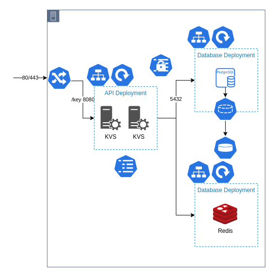

# KVS (key-value store)

A key value webservice that is cached with Redis and backed by Postgres.

### Usage
`POST /{key}` with the request body as the `value`

`GET /{key}` to return the `value` in the response body

`DELETE /{key}` to delete the `key` `value` pair from the cache and database

Pass the `-grpc` to the binary on startup to enable the gRPC server instead of json. The gRPC spec is in `/pkg/kvs`.

Set the `PORT` environment variable to define the port the service listens on.

Set the `TTL` environment variable to define how long Redis will cache key values.

### Other
The `/k8s/helm` directory contains the Helm Chart to easily deploy the system, based on the files in the parent directory.

### TODO
- [x] Add SQLITE_DB env var to use local sqlite db instead of postgres
- [x] Add env var to disable redis cache requirement
- [x] Update Helm chart to take database and cache parameters, but don't manage them
